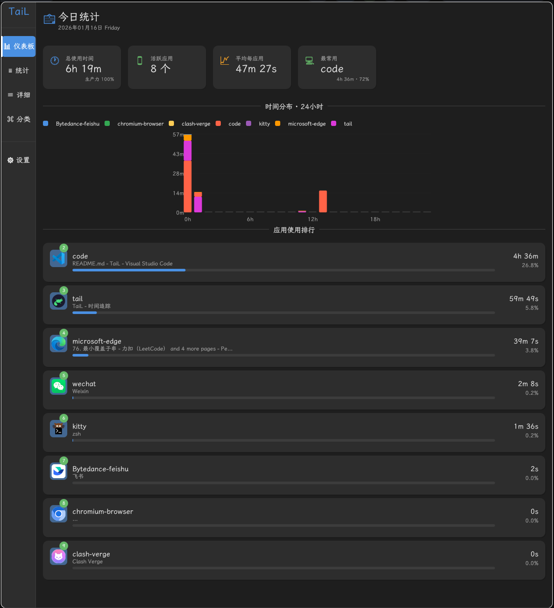

# TaiL - Window time tracker for Hyprland/Wayland


专为 Hyprland/Wayland 设计的窗口使用时间追踪工具，参考 Windows 下 Tai 软件和 ActivityWatch 的设计理念。

## 功能特性

- **自动窗口追踪** - 通过 Hyprland IPC 实时监听窗口活动
- **可视化统计** - 原生 GUI 界面展示使用数据
- **AFK 检测** - 自动检测空闲时间
- **目标限制** - 设置应用使用时长限制和提醒
- **多维度统计** - 按小时/天/周/月查看时间分布

## 界面预览



## 快速开始

### NixOS 用户

```bash
# 直接运行（无需安装）
nix run github:vitus213/tail

# 或安装到系统
nix profile install github:vitus213/tail
```

详细安装指南请查看 [安装文档](docs/user/installation.md)。

### 其他 Linux 发行版

```bash
# 使用 Cargo 安装
cargo install tail

# 或从源码构建
git clone https://github.com/vitus213/tail.git
cd tail
cargo build --release
```

## 使用

```bash
# 启动后台服务
tail-service

# 运行 GUI 查看统计
tail-app
```

## 文档

- [用户指南](docs/user/) - 安装、配置和使用说明
- [开发文档](docs/developer/) - 架构、开发和贡献指南

## 项目结构

```
tail/
├── tail-core/        # 核心数据模型和数据库
├── tail-hyprland/    # Hyprland IPC 客户端
├── tail-afk/         # AFK 检测模块
├── tail-gui/         # egui 界面
├── tail-service/     # 后台服务
└── tail-app/         # 应用入口
```

## 技术栈

| 类别 | 技术 |
|------|------|
| 语言 | Rust 1.84+ |
| 运行时 | Tokio |
| 数据库 | SQLite |
| GUI | egui/eframe |
| 构建 | Nix Flakes |

## 许可证

MIT License
