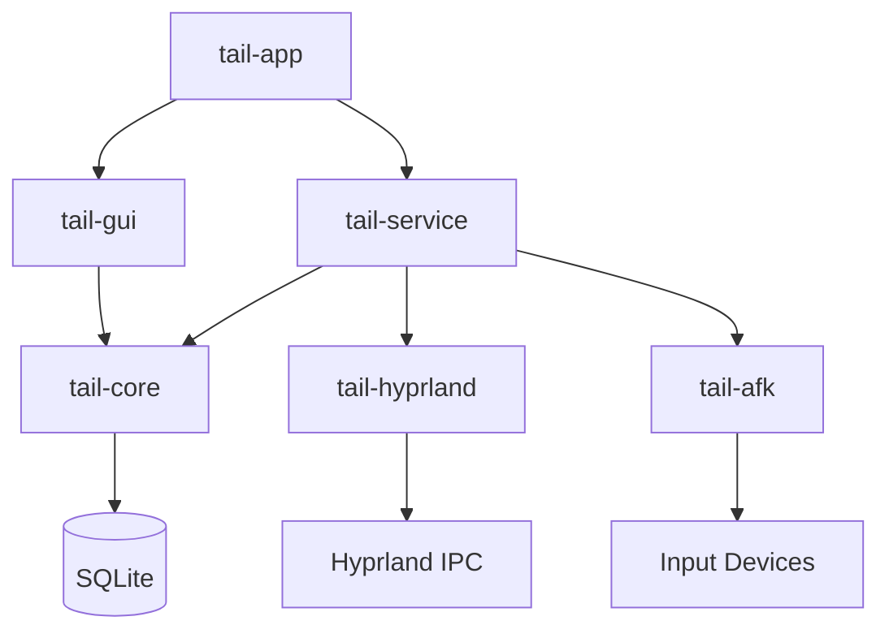
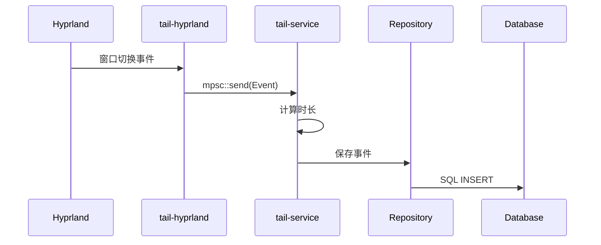

# TaiL 架构设计

本文档介绍 TaiL 的整体架构、模块设计和数据流。

## 目录

- [架构概览](#架构概览)
- [核心模块](#核心模块)
- [数据模型](#数据模型)
- [技术栈](#技术栈)
- [设计原则](#设计原则)

---

## 架构概览

### 分层架构

```
┌─────────────────────────────────────────────────────────┐
│                    表现层 (Presentation)                  │
│                  tail-gui / tail-app                      │
└─────────────────────────────────────────────────────────┘
                            ▼
┌─────────────────────────────────────────────────────────┐
│                     业务层 (Business)                     │
│                       tail-service                        │
└─────────────────────────────────────────────────────────┘
                            ▼
┌─────────────────────────────────────────────────────────┐
│                      数据层 (Data)                         │
│               tail-core (Repository)                      │
└─────────────────────────────────────────────────────────┘
                            ▼
┌─────────────────────────────────────────────────────────┐
│                    集成层 (Integration)                   │
│              tail-hyprland / tail-afk                     │
└─────────────────────────────────────────────────────────┘
```

### 模块依赖关系



---

## 核心模块

### tail-app

应用入口，提供两个可执行文件：

- `tail-app` - GUI 应用启动器
- `tail-service` - 后台服务启动器

### tail-gui

基于 egui 的图形用户界面。

**主要组件：**
- `TaiLApp` - 主应用结构
- `DashboardView` - 仪表板视图
- `StatisticsView` - 统计视图
- `SettingsView` - 设置视图

**功能：**
- 数据可视化
- 用户交互处理
- 主题管理

### tail-service

后台服务，负责协调所有模块。

**主要组件：**
- `TailService` - 核心服务结构
- 事件处理循环
- 时长计算逻辑

**功能：**
- 监听 Hyprland 事件
- 计算窗口使用时长
- 管理 AFK 状态
- 持久化数据

### tail-core

核心数据模型和数据库访问层。

**主要组件：**
- `models` - 数据模型定义
- `repositories` - 数据访问层
- `services` - 业务逻辑服务

**功能：**
- 数据持久化
- 数据查询
- 业务规则

### tail-hyprland

Hyprand IPC 客户端，与 Hyprland 窗口管理器通信。

**主要组件：**
- `HyprlandIPC` - IPC 客户端
- 事件解析器

**功能：**
- 连接 Hyprland socket
- 订阅窗口事件
- 解析事件数据

### tail-afk

AFK（Away From Keyboard）检测模块。

**主要组件：**
- `AfkDetector` - AFK 检测器

**功能：**
- 监听输入设备
- 检测空闲状态
- 触发 AFK 事件

---

## 数据模型

### WindowEvent

窗口使用记录。

```rust
pub struct WindowEvent {
    pub id: Option<i64>,
    pub app_name: String,
    pub window_title: String,
    pub start_time: DateTime<Utc>,
    pub duration_secs: i64,
    pub is_afk: bool,
}
```

### AfkEvent

空闲时段记录。

```rust
pub struct AfkEvent {
    pub id: Option<i64>,
    pub start_time: DateTime<Utc>,
    pub end_time: Option<DateTime<Utc>>,
    pub duration_secs: i64,
}
```

### DailyGoal

每日使用目标。

```rust
pub struct DailyGoal {
    pub id: Option<i64>,
    pub app_name: String,
    pub target_secs: i64,
    pub date: String,
}
```

### Category

应用分类（计划中）。

```rust
pub struct Category {
    pub id: Option<i64>,
    pub name: String,
    pub icon: String,  // emoji
    pub color: Option<String>,
}
```

---

## 数据库结构

### 表结构

```sql
-- 窗口使用记录
CREATE TABLE window_events (
    id INTEGER PRIMARY KEY AUTOINCREMENT,
    app_name TEXT NOT NULL,
    window_title TEXT,
    start_time TEXT NOT NULL,
    duration_secs INTEGER NOT NULL,
    is_afk INTEGER NOT NULL DEFAULT 0
);

CREATE INDEX idx_window_events_time ON window_events(start_time);
CREATE INDEX idx_window_events_app ON window_events(app_name);

-- 空闲时段记录
CREATE TABLE afk_events (
    id INTEGER PRIMARY KEY AUTOINCREMENT,
    start_time TEXT NOT NULL,
    end_time TEXT,
    duration_secs INTEGER NOT NULL
);

-- 每日使用目标
CREATE TABLE daily_goals (
    id INTEGER PRIMARY KEY AUTOINCREMENT,
    app_name TEXT NOT NULL UNIQUE,
    target_secs INTEGER NOT NULL,
    date TEXT NOT NULL
);
```

---

## 技术栈

| 类别 | 技术 | 版本 | 用途 |
|------|------|------|------|
| 语言 | Rust | 1.84+ | 系统编程 |
| 运行时 | Tokio | 1.40 | 异步事件处理 |
| 数据库 | SQLite + rusqlite | 0.32 | 本地数据存储 |
| 连接池 | r2d2 | 0.8 | 数据库连接管理 |
| GUI | egui/eframe | 0.28 | 原生跨平台界面 |
| 序列化 | serde | 1.0 | 数据序列化 |
| 日志 | tracing | 0.1 | 结构化日志 |
| 错误处理 | thiserror + anyhow | 1.0 | 类型安全错误 |
| 构建 | Nix Flakes | - | 可复现构建 |

---

## 设计原则

### 1. 高内聚低耦合

每个模块职责单一明确：
- `tail-core` 只负责数据持久化
- `tail-service` 只负责业务协调
- `tail-gui` 只负责用户界面

模块间通过明确的接口通信，避免循环依赖。

### 2. 事件驱动

基于 Tokio 异步运行时，使用 channel 解耦组件：



### 3. 可扩展性

- 接口抽象支持多实现
- 插件化设计
- 配置驱动

### 4. 可维护性

- Nix Flakes 保证构建一致性
- 完善的文档和注释
- 清晰的错误处理策略

---

## 数据流

### 窗口追踪流程

```
Hyprland → tail-hyprland → tail-service → tail-core → SQLite
  (IPC)      (事件解析)      (时长计算)    (Repository)  (持久化)
```

### 数据查询流程

```
tail-gui → tail-core → SQLite
 (UI请求)  (Repository)  (查询)
```

---

## 并发模型

### 服务端（异步）

```rust
Tokio Runtime
├─ Task 1: Hyprland IPC 订阅 (异步读取)
│  └─ mpsc::send(Event)
├─ Task 2: 事件处理循环
│  └─ mpsc::recv() → 计算时长 → 写数据库
└─ Task 3: AFK 检测 (定期检查)
```

### 客户端（同步）

```rust
eframe::App
└─ update() 每帧
   ├─ 处理用户输入
   ├─ 查询数据 (同步)
   └─ 渲染 UI
```

---

## 性能优化

### 数据库层面

- 连接池 (r2d2, 最大 10 连接)
- 索引优化 (timestamp, app_name)
- 批量写入 (事务)

### 内存层面

- 有界 channel (容量 100)
- 分页加载历史数据
- GUI 数据缓存

### 延迟层面

- 异步数据库写入
- UI 数据缓存（每 10 秒刷新）

---

## 目录结构

```
tail/
├── tail-core/
│   └── src/
│       ├── models.rs          # 数据模型
│       ├── repositories/      # 数据访问层
│       │   ├── mod.rs
│       │   ├── window_event.rs
│       │   ├── afk_event.rs
│       │   └── daily_goal.rs
│       └── services/          # 业务逻辑服务
├── tail-hyprland/
│   └── src/
│       ├── ipc.rs             # IPC 客户端
│       └── events.rs          # 事件解析
├── tail-afk/
│   └── src/
│       └── detector.rs        # AFK 检测
├── tail-gui/
│   └── src/
│       ├── app.rs             # 主应用
│       ├── views/             # 视图
│       │   ├── mod.rs
│       │   ├── dashboard.rs
│       │   ├── statistics.rs
│       │   └── settings.rs
│       ├── components/        # UI 组件
│       │   ├── mod.rs
│       │   ├── app_card.rs
│       │   └── time_navigation.rs
│       └── icons/             # 图标管理
├── tail-service/
│   └── src/
│       └── service.rs         # 核心服务
├── tail-app/
│   └── src/
│       └── main.rs            # 应用入口
└── tests/
    └── integration/           # 集成测试
```

更多详细信息请查看 [开发环境文档](development.md)。
