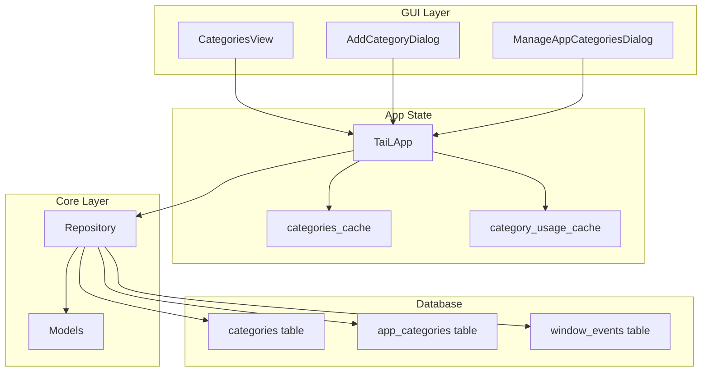
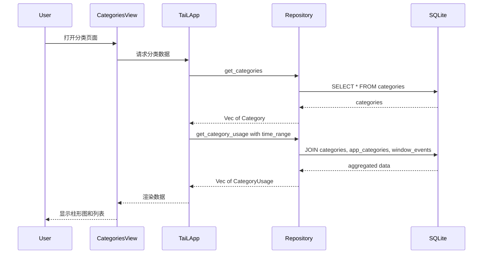

# 应用分类功能设计方案

## 概述

为 TaiL 时间追踪工具添加应用分类功能，允许用户自定义分类并将应用归类，然后按分类查看使用时间统计。

## 需求分析

### 核心功能
1. **自定义分类管理**：用户可以创建、编辑、删除分类
2. **分类图标选择**：使用预设的 emoji 图标
3. **应用归类**：一个应用可以属于多个分类
4. **分类统计展示**：
   - 柱形图展示各分类的总使用时间
   - 列表展示各分类的详细时间

### 用户确认的设计决策
- 使用预设 emoji 图标（不使用系统图标）
- 一个应用可以属于多个分类
- 完全由用户自定义分类（无默认分类）

## 数据模型设计

### 新增数据库表

```sql
-- 分类表
CREATE TABLE IF NOT EXISTS categories (
    id INTEGER PRIMARY KEY AUTOINCREMENT,
    name TEXT NOT NULL UNIQUE,
    icon TEXT NOT NULL,  -- emoji 图标
    color TEXT,          -- 可选的颜色代码
    created_at DATETIME DEFAULT CURRENT_TIMESTAMP
);

-- 应用-分类关联表（多对多关系）
CREATE TABLE IF NOT EXISTS app_categories (
    id INTEGER PRIMARY KEY AUTOINCREMENT,
    app_name TEXT NOT NULL,
    category_id INTEGER NOT NULL,
    created_at DATETIME DEFAULT CURRENT_TIMESTAMP,
    FOREIGN KEY (category_id) REFERENCES categories(id) ON DELETE CASCADE,
    UNIQUE(app_name, category_id)
);

-- 索引
CREATE INDEX IF NOT EXISTS idx_app_categories_app ON app_categories(app_name);
CREATE INDEX IF NOT EXISTS idx_app_categories_category ON app_categories(category_id);
```

### Rust 数据模型

```rust
// tail-core/src/models.rs

/// 应用分类
#[derive(Debug, Clone, Serialize, Deserialize)]
pub struct Category {
    pub id: Option<i64>,
    pub name: String,
    pub icon: String,  // emoji
    pub color: Option<String>,
}

/// 应用-分类关联
#[derive(Debug, Clone, Serialize, Deserialize)]
pub struct AppCategory {
    pub id: Option<i64>,
    pub app_name: String,
    pub category_id: i64,
}

/// 分类使用统计
#[derive(Debug, Clone, Serialize, Deserialize)]
pub struct CategoryUsage {
    pub category: Category,
    pub total_seconds: i64,
    pub app_count: usize,
    pub apps: Vec<String>,
}
```

## UI 设计

### 页面布局

```
┌─────────────────────────────────────────────────────────────┐
│  📂 应用分类                                                 │
│  管理您的应用分类                                            │
├─────────────────────────────────────────────────────────────┤
│                                                             │
│  ┌─ 时间范围选择器 ─────────────────────────────────────┐   │
│  │ [今天] [昨天] [7天] [30天]                           │   │
│  └─────────────────────────────────────────────────────┘   │
│                                                             │
│  ┌─ 分类时间柱形图 ─────────────────────────────────────┐   │
│  │                                                       │   │
│  │   ████████████████  工作 💼  4h 30m                  │   │
│  │   ██████████        娱乐 🎮  2h 15m                  │   │
│  │   ████████          开发 💻  1h 45m                  │   │
│  │   ████              社交 💬  0h 50m                  │   │
│  │                                                       │   │
│  └─────────────────────────────────────────────────────┘   │
│                                                             │
│  ┌─ 分类详情列表 ───────────────────────────────────────┐   │
│  │                                                       │   │
│  │  💼 工作                              4h 30m    [管理]│   │
│  │     ├─ code (2h 15m)                                 │   │
│  │     ├─ firefox (1h 30m)                              │   │
│  │     └─ slack (45m)                                   │   │
│  │                                                       │   │
│  │  🎮 娱乐                              2h 15m    [管理]│   │
│  │     ├─ steam (1h 30m)                                │   │
│  │     └─ discord (45m)                                 │   │
│  │                                                       │   │
│  └─────────────────────────────────────────────────────┘   │
│                                                             │
│  ┌─ 分类管理 ───────────────────────────────────────────┐   │
│  │                                                       │   │
│  │  [➕ 添加分类]  [📝 管理应用归类]                     │   │
│  │                                                       │   │
│  └─────────────────────────────────────────────────────┘   │
│                                                             │
└─────────────────────────────────────────────────────────────┘
```

### 添加分类对话框

```
┌─────────────────────────────────────┐
│  添加新分类                          │
├─────────────────────────────────────┤
│                                     │
│  分类名称                            │
│  ┌─────────────────────────────┐   │
│  │ 工作                         │   │
│  └─────────────────────────────┘   │
│                                     │
│  选择图标                            │
│  ┌─────────────────────────────┐   │
│  │ 💼 💻 🎮 📱 🎵 📚 🎨 ⚙️    │   │
│  │ 💬 📧 🌐 📊 🔧 🎯 📝 🏠    │   │
│  │ 🎬 📷 🛒 💰 🏃 🍔 ✈️ 🎓    │   │
│  └─────────────────────────────┘   │
│                                     │
│  [取消]              [确定]         │
│                                     │
└─────────────────────────────────────┘
```

### 应用归类对话框

```
┌─────────────────────────────────────┐
│  管理应用归类                        │
├─────────────────────────────────────┤
│                                     │
│  搜索应用: [____________]           │
│                                     │
│  ┌─ 应用列表 ───────────────────┐   │
│  │                               │   │
│  │  🔵 code                      │   │
│  │     [✓] 💼 工作               │   │
│  │     [✓] 💻 开发               │   │
│  │     [ ] 🎮 娱乐               │   │
│  │                               │   │
│  │  🔵 firefox                   │   │
│  │     [✓] 💼 工作               │   │
│  │     [ ] 💻 开发               │   │
│  │     [✓] 🎮 娱乐               │   │
│  │                               │   │
│  └───────────────────────────────┘   │
│                                     │
│  [关闭]                             │
│                                     │
└─────────────────────────────────────┘
```

## 预设 Emoji 图标列表

```rust
const CATEGORY_ICONS: &[&str] = &[
    // 工作/办公
    "💼", "💻", "📊", "📈", "📋", "📁", "📂", "🗂️",
    // 开发/技术
    "⚙️", "🔧", "🛠️", "💾", "🖥️", "⌨️", "🔌", "🧪",
    // 娱乐/游戏
    "🎮", "🎲", "🎯", "🎪", "🎭", "🎨", "🎬", "📺",
    // 社交/通讯
    "💬", "📱", "📧", "✉️", "🗣️", "👥", "🤝", "💌",
    // 音乐/媒体
    "🎵", "🎶", "🎧", "🎤", "📻", "🎹", "🎸", "🥁",
    // 学习/阅读
    "📚", "📖", "📝", "✏️", "🎓", "🧠", "💡", "🔬",
    // 生活/其他
    "🏠", "🛒", "💰", "🏃", "🍔", "✈️", "🌐", "⭐",
];
```

## 文件结构变更

```
tail-core/src/
├── models.rs          # 添加 Category, AppCategory, CategoryUsage
└── db.rs              # 添加分类相关的数据库操作

tail-gui/src/
├── app.rs             # 添加 Categories 视图和相关状态
├── views/
│   ├── mod.rs         # 导出 categories 模块
│   └── categories.rs  # 新增：分类视图页面
└── components/
    └── mod.rs         # 可能需要新增分类相关组件
```

## 实现步骤

### 阶段 1：数据层实现

1. **更新数据模型** [`tail-core/src/models.rs`](tail-core/src/models.rs)
   - 添加 `Category` 结构体
   - 添加 `AppCategory` 结构体
   - 添加 `CategoryUsage` 结构体

2. **更新数据库层** [`tail-core/src/db.rs`](tail-core/src/db.rs)
   - 添加 `categories` 和 `app_categories` 表的创建
   - 实现分类 CRUD 操作：
     - `insert_category()`
     - `update_category()`
     - `delete_category()`
     - `get_categories()`
     - `get_category_by_id()`
   - 实现应用归类操作：
     - `add_app_to_category()`
     - `remove_app_from_category()`
     - `get_app_categories()`
     - `get_category_apps()`
   - 实现分类统计：
     - `get_category_usage()`

### 阶段 2：UI 层实现

3. **创建分类视图** `tail-gui/src/views/categories.rs`
   - `CategoriesView` 结构体
   - 时间范围选择器
   - 分类柱形图组件
   - 分类详情列表
   - 分类管理按钮

4. **创建对话框组件**
   - `AddCategoryDialog` - 添加分类对话框
   - `EditCategoryDialog` - 编辑分类对话框
   - `ManageAppCategoriesDialog` - 应用归类管理对话框

5. **更新主应用** [`tail-gui/src/app.rs`](tail-gui/src/app.rs)
   - 添加 `View::Categories` 枚举值
   - 添加分类相关的状态缓存
   - 添加导航按钮
   - 处理分类相关的操作

### 阶段 3：集成和测试

6. **集成测试**
   - 测试分类 CRUD 操作
   - 测试应用归类功能
   - 测试统计计算

## 架构图



## 数据流



## 注意事项

1. **性能考虑**
   - 分类统计查询可能涉及多表 JOIN，需要适当的索引
   - 考虑缓存分类数据，减少数据库查询

2. **用户体验**
   - 未分类的应用应该有明确的提示
   - 删除分类时需要确认对话框
   - 支持拖拽排序分类（可选，后续优化）

3. **数据一致性**
   - 删除分类时，关联的 `app_categories` 记录应该级联删除
   - 应用名称变更时需要考虑历史数据

4. **兼容性**
   - 新增的数据库表不影响现有功能
   - 旧版本数据库升级时自动创建新表
