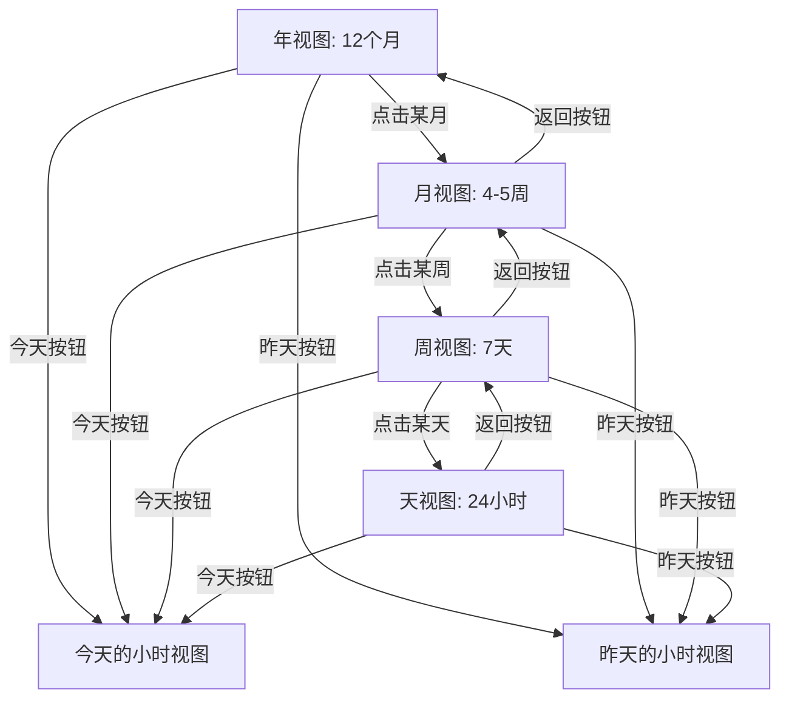

# 柱形视图层级导航重构方案

## 概述

重构统计视图中的柱形图，实现可下钻的层级时间导航系统，支持从年视图逐级深入到小时视图，并提供"今天"和"昨天"快捷跳转功能。

## 需求分析

根据用户需求，需要实现以下层级导航结构：

1. **年视图**：显示12个月的柱形图
2. **月视图**：显示当月每一周（4-5周）的柱形图
3. **周视图**：显示当周每一天（7天）的柱形图
4. **天视图（小时视图）**：显示当天24小时的柱形图
5. **快捷功能**：可以快速跳转到"今天"和"昨天"

## 现有代码分析

### 当前实现

从 [`tail-gui/src/views/statistics.rs`](tail-gui/src/views/statistics.rs:1) 分析：

- 当前使用 [`TimeRange`](tail-core/src/models.rs:45) 枚举来表示时间范围（Today, Yesterday, Last7Days, Last30Days, Custom）
- 已有 [`draw_hourly_chart()`](tail-gui/src/views/statistics.rs:109) 方法绘制24小时分布图
- 已有 [`draw_daily_chart_interactive()`](tail-gui/src/views/statistics.rs:317) 方法绘制可交互的按天分布图
- 点击柱子可以切换到 [`TimeRange::Custom`](tail-core/src/models.rs:51) 自定义范围

### 已有的导航模型

从 [`tail-core/src/models.rs`](tail-core/src/models.rs:54) 发现已经定义了：

- [`TimeNavigationLevel`](tail-core/src/models.rs:56) 枚举：Year, Month, Week, Day, Hour
- [`TimeNavigationState`](tail-core/src/models.rs:76) 结构体：管理导航状态
- 已实现的方法：
  - [`go_back()`](tail-core/src/models.rs:103)：返回上一级
  - [`drill_into_year()`](tail-core/src/models.rs:125)：进入年份的月份视图
  - [`drill_into_month()`](tail-core/src/models.rs:131)：进入月份的周视图
  - [`drill_into_week()`](tail-core/src/models.rs:137)：进入周的天视图
  - [`drill_into_day()`](tail-core/src/models.rs:143)：进入天的小时视图
  - [`go_to_today()`](tail-core/src/models.rs:149)：跳转到今天
  - [`get_breadcrumb()`](tail-core/src/models.rs:158)：获取面包屑导航文本

## 架构设计

### 1. 数据模型扩展

利用现有的 [`TimeNavigationState`](tail-core/src/models.rs:76)，需要添加：

```rust
// 在 tail-core/src/models.rs 中添加
impl TimeNavigationState {
    /// 跳转到昨天
    pub fn go_to_yesterday(&mut self, year: i32, month: u32, day: u32) {
        self.selected_year = year;
        self.selected_month = Some(month);
        self.selected_day = Some(day);
        self.selected_week = None;
        self.level = TimeNavigationLevel::Hour;
    }
    
    /// 获取当前导航状态对应的时间范围
    pub fn to_time_range(&self) -> TimeRange {
        // 根据 level 和选中的年月日周计算 TimeRange::Custom
    }
}
```

### 2. 数据聚合逻辑

需要实现不同层级的数据聚合函数：

```rust
// 在 StatisticsView 中添加
impl<'a> StatisticsView<'a> {
    /// 按年聚合：返回12个月的使用数据
    fn aggregate_by_year(&self, year: i32) -> Vec<PeriodUsage> {
        // 遍历 app_usage，按月份聚合
        // 返回 1-12 月的数据
    }
    
    /// 按月聚合：返回当月各周的使用数据
    fn aggregate_by_month(&self, year: i32, month: u32) -> Vec<PeriodUsage> {
        // 计算该月有几周（4-5周）
        // 按周聚合数据
    }
    
    /// 按周聚合：返回当周7天的使用数据
    fn aggregate_by_week(&self, year: i32, month: u32, week: u32) -> Vec<PeriodUsage> {
        // 计算该周的起止日期
        // 按天聚合数据（周一到周日）
    }
    
    /// 按天聚合：返回当天24小时的使用数据
    fn aggregate_by_day(&self, year: i32, month: u32, day: u32) -> Vec<PeriodUsage> {
        // 按小时聚合数据（0-23时）
    }
}
```

### 3. 交互式柱形图组件

创建统一的可下钻柱形图组件：

```rust
/// 层级柱形图组件
struct HierarchicalBarChart<'a> {
    /// 时间段数据
    periods: &'a [PeriodUsage],
    /// 当前导航层级
    level: TimeNavigationLevel,
    /// 图表标题
    title: &'a str,
    /// 主题
    theme: &'a TaiLTheme,
}

impl<'a> HierarchicalBarChart<'a> {
    /// 显示图表，返回被点击的时间段索引
    fn show(&self, ui: &mut Ui) -> Option<i32> {
        // 绘制柱形图
        // 处理鼠标悬停和点击
        // 显示工具提示
    }
}
```

### 4. 导航控制组件

创建面包屑导航和快捷按钮：

```rust
/// 时间导航控制器
struct TimeNavigationController<'a> {
    /// 当前导航状态
    state: &'a TimeNavigationState,
    /// 主题
    theme: &'a TaiLTheme,
}

impl<'a> TimeNavigationController<'a> {
    /// 显示导航控制器
    /// 返回：(是否返回上一级, 是否跳转今天, 是否跳转昨天)
    fn show(&self, ui: &mut Ui) -> (bool, bool, bool) {
        // 显示面包屑导航
        // 显示返回按钮
        // 显示"今天"和"昨天"快捷按钮
    }
}
```

## UI 布局设计

### 整体布局

```
┌─────────────────────────────────────────────────────────┐
│ 📈 详细统计                                              │
│ 查看应用使用详情                                          │
├─────────────────────────────────────────────────────────┤
│ 导航：2026年 > 1月 > 第2周    [⬅ 返回] [今天] [昨天]    │
├─────────────────────────────────────────────────────────┤
│                                                          │
│  时间分布 (点击柱子查看详情)                              │
│  ┌────────────────────────────────────────────────┐    │
│  │  █                                              │    │
│  │  █     █                                        │    │
│  │  █  █  █  █                                     │    │
│  │  █  █  █  █  █  █  █                           │    │
│  │ 周一 周二 周三 周四 周五 周六 周日                │    │
│  └────────────────────────────────────────────────┘    │
│                                                          │
├─────────────────────────────────────────────────────────┤
│  应用详情                                                │
│  [应用列表表格]                                          │
└─────────────────────────────────────────────────────────┘
```

### 各层级显示内容

1. **年视图（Month Level）**
   - 标题：`2026年`
   - 柱形图：12个柱子（1月-12月）
   - X轴标签：`1月`, `2月`, ..., `12月`
   - 点击：进入该月的周视图

2. **月视图（Week Level）**
   - 面包屑：`2026年 > 1月`
   - 柱形图：4-5个柱子（第1周-第5周）
   - X轴标签：`第1周`, `第2周`, ..., `第5周`
   - 点击：进入该周的天视图

3. **周视图（Day Level）**
   - 面包屑：`2026年 > 1月 > 第2周`
   - 柱形图：7个柱子（周一-周日）
   - X轴标签：`周一`, `周二`, ..., `周日`
   - 点击：进入该天的小时视图

4. **天视图（Hour Level）**
   - 面包屑：`2026年 > 1月 > 第2周 > 15日`
   - 柱形图：24个柱子（0时-23时）
   - X轴标签：`0时`, `3时`, `6时`, ..., `21时`（每3小时显示）
   - 点击：无操作（最底层）

## 交互流程

### 下钻流程



### 状态管理

在 [`StatisticsView`](tail-gui/src/views/statistics.rs:14) 中添加导航状态：

```rust
pub struct StatisticsView<'a> {
    app_usage: &'a [AppUsage],
    time_range: TimeRange,  // 保留用于数据查询
    navigation_state: TimeNavigationState,  // 新增：导航状态
    theme: &'a TaiLTheme,
    icon_cache: &'a mut IconCache,
}
```

## 实现步骤

### 阶段1：数据层扩展

1. ✅ 已有 [`TimeNavigationState`](tail-core/src/models.rs:76) 和 [`TimeNavigationLevel`](tail-core/src/models.rs:56)
2. 添加 `go_to_yesterday()` 方法
3. 添加 `to_time_range()` 方法用于数据查询
4. 利用现有的 [`PeriodUsage`](tail-core/src/models.rs:187) 结构体

### 阶段2：数据聚合实现

1. 实现 `aggregate_by_year()` - 按月聚合
2. 实现 `aggregate_by_month()` - 按周聚合
3. 实现 `aggregate_by_week()` - 按天聚合
4. 实现 `aggregate_by_day()` - 按小时聚合（复用现有逻辑）

### 阶段3：UI组件开发

1. 创建 `HierarchicalBarChart` 组件
   - 统一的柱形图绘制逻辑
   - 支持不同层级的标签格式
   - 交互式点击和悬停
   
2. 创建 `TimeNavigationController` 组件
   - 面包屑导航显示
   - 返回按钮
   - "今天"和"昨天"快捷按钮

### 阶段4：集成到统计视图

1. 修改 [`StatisticsView`](tail-gui/src/views/statistics.rs:14) 添加 `navigation_state` 字段
2. 重构 [`show()`](tail-gui/src/views/statistics.rs:41) 方法：
   - 显示导航控制器
   - 根据当前层级显示对应的柱形图
   - 处理导航事件（点击柱子、返回、快捷跳转）
3. 保留现有的应用详情表格

### 阶段5：测试和优化

1. 测试各层级之间的导航
2. 测试快捷跳转功能
3. 优化性能（数据聚合缓存）
4. 优化UI细节（动画、颜色、间距）

## 技术细节

### 周的计算

使用 `chrono` 库计算周：

```rust
use chrono::{Datelike, NaiveDate};

fn get_week_of_month(date: NaiveDate) -> u32 {
    let first_day = NaiveDate::from_ymd_opt(date.year(), date.month(), 1).unwrap();
    let first_weekday = first_day.weekday().num_days_from_monday();
    let day_of_month = date.day();
    
    ((day_of_month + first_weekday - 1) / 7) + 1
}
```

### 数据查询优化

根据导航状态计算精确的时间范围，避免查询不必要的数据：

```rust
impl TimeNavigationState {
    pub fn to_time_range(&self) -> TimeRange {
        use chrono::{NaiveDate, TimeZone, Utc};
        
        match self.level {
            TimeNavigationLevel::Year => {
                // 整年：1月1日 00:00 - 12月31日 23:59
                let start = Utc.ymd(self.selected_year, 1, 1).and_hms(0, 0, 0);
                let end = Utc.ymd(self.selected_year, 12, 31).and_hms(23, 59, 59);
                TimeRange::Custom(start, end)
            }
            TimeNavigationLevel::Month => {
                // 整月
                let month = self.selected_month.unwrap();
                // ... 计算月的起止时间
            }
            // ... 其他层级
        }
    }
}
```

### 颜色方案

根据使用量使用渐变色：

- 高使用量（>75%）：`theme.primary_color`
- 中使用量（50-75%）：`theme.primary_color.linear_multiply(0.7)`
- 低使用量（>0%）：`theme.primary_color.linear_multiply(0.4)`
- 无使用：`theme.divider_color`
- 悬停高亮：`theme.accent_color`

## 兼容性考虑

### 保留现有功能

1. 保留 [`TimeRangeSelector`](tail-gui/src/components/time_selector.rs:9)（今天/昨天/7天/30天）作为快捷选项
2. 新的层级导航作为主要交互方式
3. 两种方式可以共存：
   - 点击快捷选项：自动设置导航状态到对应层级
   - 使用层级导航：更精细的时间控制

### 数据兼容

- 继续使用 [`TimeRange`](tail-core/src/models.rs:45) 进行数据库查询
- [`TimeNavigationState`](tail-core/src/models.rs:76) 仅用于UI导航
- 通过 `to_time_range()` 方法桥接两者

## 用户体验优化

### 视觉反馈

1. 悬停时柱子高亮显示
2. 显示工具提示（日期 + 使用时长）
3. 点击时有视觉反馈
4. 面包屑导航清晰显示当前位置

### 性能优化

1. 数据聚合结果缓存
2. 只在导航状态变化时重新聚合
3. 使用增量更新而非全量重绘

### 可访问性

1. 键盘导航支持（方向键切换柱子，Enter下钻，Esc返回）
2. 清晰的视觉层次
3. 足够的对比度

## 总结

本方案充分利用了现有的 [`TimeNavigationState`](tail-core/src/models.rs:76) 和 [`TimeNavigationLevel`](tail-core/src/models.rs:56) 模型，只需要：

1. 扩展少量方法（`go_to_yesterday()`, `to_time_range()`）
2. 实现数据聚合逻辑
3. 创建可复用的UI组件
4. 集成到现有的统计视图

这样可以在保持代码整洁的同时，提供强大的时间导航功能。
