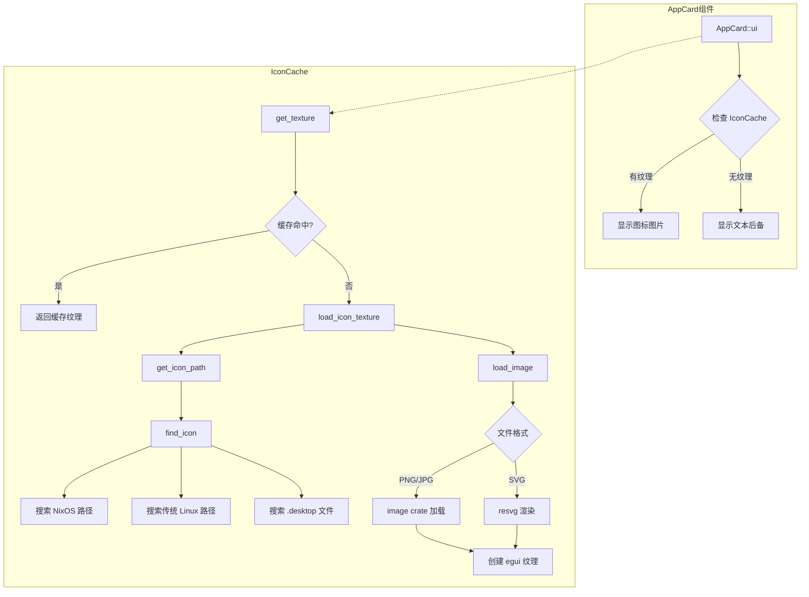

# 应用图标显示修复方案

## 问题描述

TaiL 应用列表中的应用图标位置只显示缩写文本或 emoji，而不是真实的应用图标。

## 问题根因

### 1. AppCard 组件未集成 IconCache

[`AppCard`](../tail-gui/src/components/app_card.rs:8) 组件使用自己的 [`get_app_icon()`](../tail-gui/src/components/app_card.rs:85) 方法返回 emoji，而没有使用已实现的 [`IconCache`](../tail-gui/src/icons/cache.rs:15) 来加载真实图标。

### 2. SVG 图标不支持

[`IconCache::load_image()`](../tail-gui/src/icons/cache.rs:148) 方法中，SVG 格式被跳过：

```rust
"svg" => {
    // SVG 需要额外的库来渲染，暂时跳过
    None
}
```

### 3. NixOS 图标路径缺失

当前搜索路径（在 [`find_icon()`](../tail-gui/src/icons/cache.rs:182)）：
- `/usr/share/icons/hicolor/*/apps`
- `/usr/share/pixmaps`
- `/usr/share/icons/Adwaita/*/apps`
- `/usr/share/icons/breeze/apps/*`

NixOS 实际图标路径：
- `/run/current-system/sw/share/icons/hicolor/*/apps`
- `/run/current-system/sw/share/pixmaps`

## NixOS 系统图标格式分布

| 目录 | PNG | SVG | XPM |
|------|-----|-----|-----|
| hicolor/48x48/apps | 6 | 0 | 1 |
| hicolor/scalable/apps | 0 | 6 | 0 |
| pixmaps | 3 | 0 | 12 |

**结论**：需要同时支持 PNG 和 SVG 格式。

## 解决方案

### 架构图



### 实现步骤

#### 步骤 1：添加 resvg 依赖

修改 [`tail-gui/Cargo.toml`](../tail-gui/Cargo.toml)：

```toml
[dependencies]
# ... 现有依赖
resvg = "0.44"
```

#### 步骤 2：扩展图标搜索路径

修改 [`tail-gui/src/icons/cache.rs`](../tail-gui/src/icons/cache.rs) 中的 [`find_icon()`](../tail-gui/src/icons/cache.rs:182) 方法：

```rust
fn find_icon(&self, app_name: &str) -> Option<PathBuf> {
    let name_lower = app_name.to_lowercase();
    
    // 图标搜索路径（按优先级排序）
    let icon_dirs = [
        // NixOS 路径
        "/run/current-system/sw/share/icons/hicolor/48x48/apps",
        "/run/current-system/sw/share/icons/hicolor/64x64/apps",
        "/run/current-system/sw/share/icons/hicolor/128x128/apps",
        "/run/current-system/sw/share/icons/hicolor/scalable/apps",
        "/run/current-system/sw/share/pixmaps",
        // 传统 Linux 路径
        "/usr/share/icons/hicolor/48x48/apps",
        "/usr/share/icons/hicolor/64x64/apps",
        // ... 其他路径
    ];
    // ...
}
```

#### 步骤 3：实现 SVG 渲染

修改 [`load_image()`](../tail-gui/src/icons/cache.rs:148) 方法：

```rust
fn load_image(&self, path: &PathBuf) -> Option<ColorImage> {
    let extension = path.extension()?.to_str()?.to_lowercase();
    
    match extension.as_str() {
        "png" | "jpg" | "jpeg" | "ico" => {
            // 现有 PNG 加载逻辑
        }
        "svg" => {
            // 使用 resvg 渲染 SVG
            let svg_data = std::fs::read(path).ok()?;
            let tree = resvg::usvg::Tree::from_data(&svg_data, &Default::default()).ok()?;
            
            let size = ICON_SIZE;
            let mut pixmap = resvg::tiny_skia::Pixmap::new(size, size)?;
            
            let scale = size as f32 / tree.size().width().max(tree.size().height());
            let transform = resvg::tiny_skia::Transform::from_scale(scale, scale);
            
            resvg::render(&tree, transform, &mut pixmap.as_mut());
            
            let pixels = pixmap.take();
            Some(ColorImage::from_rgba_unmultiplied(
                [size as usize, size as usize],
                &pixels,
            ))
        }
        _ => None,
    }
}
```

#### 步骤 4：修改 AppCard 使用 IconCache

修改 [`tail-gui/src/components/app_card.rs`](../tail-gui/src/components/app_card.rs)：

1. 添加 `icon_cache` 字段到 `AppCard` 结构体
2. 修改 `ui()` 方法，使用 `IconCache::get_texture()` 获取图标纹理
3. 如果获取失败，回退到文本标签

```rust
pub struct AppCard<'a> {
    // ... 现有字段
    icon_cache: &'a mut IconCache,
}

impl<'a> Widget for AppCard<'a> {
    fn ui(self, ui: &mut Ui) -> Response {
        // ...
        
        // 绘制图标
        if let Some(texture) = self.icon_cache.get_texture(ui.ctx(), self.app_name) {
            let image = egui::Image::new(&*texture)
                .fit_to_exact_size(Vec2::splat(icon_size));
            ui.put(icon_rect, image);
        } else {
            // 回退到文本标签
            let label = self.icon_cache.get_emoji(self.app_name);
            painter.text(
                icon_rect.center(),
                egui::Align2::CENTER_CENTER,
                label,
                egui::FontId::proportional(24.0),
                self.theme.text_color,
            );
        }
        
        // ...
    }
}
```

#### 步骤 5：更新 DashboardView 传递 IconCache

修改 [`tail-gui/src/views/dashboard.rs`](../tail-gui/src/views/dashboard.rs) 中的 [`show_app_list()`](../tail-gui/src/views/dashboard.rs:109) 方法，将 `icon_cache` 传递给 `AppCard`。

## 注意事项

1. **性能考虑**：SVG 渲染比 PNG 加载慢，但由于有缓存机制，只需渲染一次
2. **内存使用**：图标纹理会占用 GPU 内存，但 32x32 的图标很小
3. **兼容性**：方案同时支持 NixOS 和传统 Linux 发行版

## 测试计划

1. 在 NixOS 上测试 Steam、htop 等应用的图标显示
2. 验证 SVG 图标（如 htop.svg）能正确渲染
3. 验证 PNG 图标（如 steam.png）能正确显示
4. 验证找不到图标时的文本后备显示
