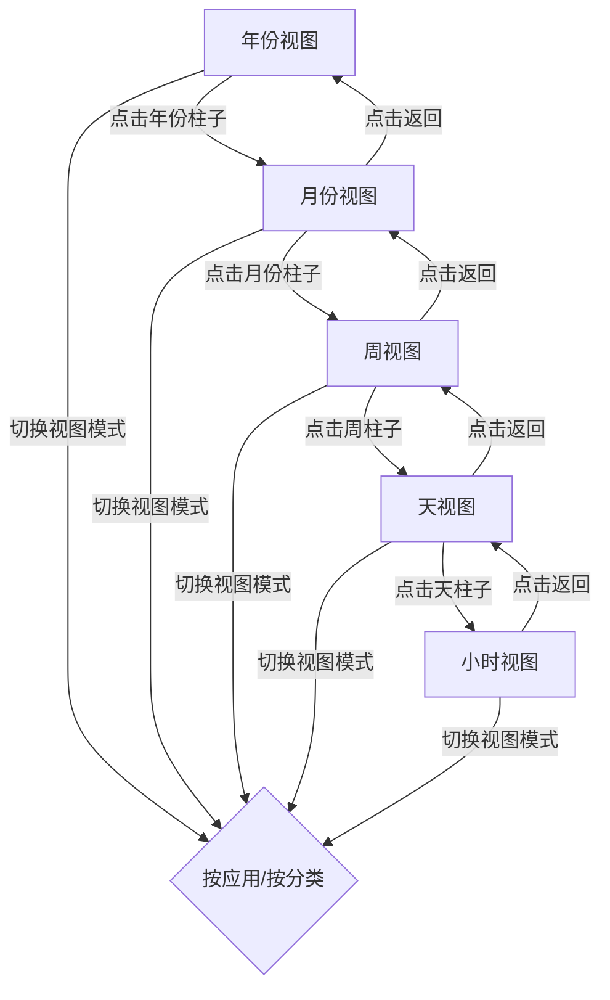

# 详细统计视图 - 层级式时间导航设计

## 需求分析

用户希望实现一个层级式的时间导航系统，支持从年份逐级下钻到小时级别的数据查看。

## 层级导航结构

```
年份视图 → 月份视图 → 周视图 → 天视图 → 小时视图
```

### 导航层级

| 层级 | 显示内容 | 柱形图数量 | 点击行为 |
|------|----------|------------|----------|
| 年份 | 今年/去年 | 2个柱子 | 进入该年的12个月视图 |
| 月份 | 12个月 | 12个柱子 | 进入该月的周视图 |
| 周 | 4-5周 | 4-5个柱子 | 进入该周的7天视图 |
| 天 | 7天 | 7个柱子 | 进入该天的24小时视图 |
| 小时 | 24小时 | 24个柱子 | 无（最底层） |

## UI 设计

### 顶部导航栏

```
┌─────────────────────────────────────────────────────────────┐
│ ← 返回上级    2026年 > 1月 > 第3周 > 周三                    │
└─────────────────────────────────────────────────────────────┘
```

### 年份视图

```
┌─────────────────────────────────────────────────────────────┐
│ 📈 详细统计                                                  │
├─────────────────────────────────────────────────────────────┤
│ 视图: [按应用] [按分类]                                      │
├─────────────────────────────────────────────────────────────┤
│ ── 年度统计 ──                                              │
│ ┌─────────────────────────────────────────────────────────┐ │
│ │         ████                                            │ │
│ │         ████     ████                                   │ │
│ │         ████     ████                                   │ │
│ │        2025年    2026年                                 │ │
│ └─────────────────────────────────────────────────────────┘ │
│                    ↑ 点击进入月份视图                        │
└─────────────────────────────────────────────────────────────┘
```

### 月份视图（点击年份后）

```
┌─────────────────────────────────────────────────────────────┐
│ ← 返回年份    2026年                                         │
├─────────────────────────────────────────────────────────────┤
│ ── 月度统计 ──                                              │
│ ┌─────────────────────────────────────────────────────────┐ │
│ │ █ █ █ █ █ █ █ █ █ █ █ █                                │ │
│ │ 1 2 3 4 5 6 7 8 9 10 11 12                             │ │
│ └─────────────────────────────────────────────────────────┘ │
│                    ↑ 点击进入周视图                          │
└─────────────────────────────────────────────────────────────┘
```

### 周视图（点击月份后）

```
┌─────────────────────────────────────────────────────────────┐
│ ← 返回月份    2026年1月                                      │
├─────────────────────────────────────────────────────────────┤
│ ── 周统计 ──                                                │
│ ┌─────────────────────────────────────────────────────────┐ │
│ │     ████   ████   ████   ████   ████                   │ │
│ │     第1周  第2周  第3周  第4周  第5周                    │ │
│ └─────────────────────────────────────────────────────────┘ │
│                    ↑ 点击进入天视图                          │
└─────────────────────────────────────────────────────────────┘
```

### 天视图（点击周后）

```
┌─────────────────────────────────────────────────────────────┐
│ ← 返回周      2026年1月 第3周                                │
├─────────────────────────────────────────────────────────────┤
│ ── 每日统计 ──                                              │
│ ┌─────────────────────────────────────────────────────────┐ │
│ │ █ █ █ █ █ █ █                                          │ │
│ │ 一 二 三 四 五 六 日                                     │ │
│ └─────────────────────────────────────────────────────────┘ │
│                    ↑ 点击进入小时视图                        │
└─────────────────────────────────────────────────────────────┘
```

### 小时视图（点击天后）

```
┌─────────────────────────────────────────────────────────────┐
│ ← 返回天      2026年1月15日 周三                             │
├─────────────────────────────────────────────────────────────┤
│ ── 小时统计 ──                                              │
│ ┌─────────────────────────────────────────────────────────┐ │
│ │ █ █ █ █ █ █ █ █ █ █ █ █ █ █ █ █ █ █ █ █ █ █ █ █       │ │
│ │ 0  3  6  9  12 15 18 21                                │ │
│ └─────────────────────────────────────────────────────────┘ │
│                    （最底层，无法继续下钻）                   │
└─────────────────────────────────────────────────────────────┘
```

## 数据模型设计

### TimeNavigationLevel 枚举

```rust
#[derive(Clone, Copy, PartialEq, Debug)]
pub enum TimeNavigationLevel {
    Year,   // 年份视图
    Month,  // 月份视图
    Week,   // 周视图
    Day,    // 天视图
    Hour,   // 小时视图
}
```

### TimeNavigationState 结构

```rust
pub struct TimeNavigationState {
    /// 当前导航层级
    pub level: TimeNavigationLevel,
    /// 选中的年份
    pub selected_year: i32,
    /// 选中的月份 (1-12)
    pub selected_month: Option<u32>,
    /// 选中的周 (1-5)
    pub selected_week: Option<u32>,
    /// 选中的日期
    pub selected_date: Option<NaiveDate>,
}
```

## 实现计划

### 1. 修改 TimeRange 枚举

```rust
pub enum TimeRange {
    // 保留原有
    Today,
    Yesterday,
    Last7Days,
    
    // 新增层级式范围
    Year(i32),                    // 某一年
    Month(i32, u32),              // 某年某月
    Week(i32, u32, u32),          // 某年某月第几周
    Day(NaiveDate),               // 某一天
    
    Custom(DateTime<Utc>, DateTime<Utc>),
}
```

### 2. 新增数据库查询方法

- `get_yearly_usage()` - 按年汇总
- `get_monthly_usage(year)` - 按月汇总
- `get_weekly_usage(year, month)` - 按周汇总
- `get_daily_usage(year, month, week)` - 按天汇总
- `get_hourly_usage(date)` - 按小时汇总

### 3. 修改 StatisticsView

- 添加 `TimeNavigationState` 字段
- 添加导航栏组件
- 根据当前层级渲染不同的柱形图
- 处理柱形图点击事件进行下钻

### 4. 添加分类视图模式

- 在工具栏添加 [按应用] [按分类] 切换
- 分类视图支持点击展开显示应用列表

## 文件修改清单

1. **tail-core/src/models.rs**
   - 修改 `TimeRange` 枚举
   - 添加 `TimeNavigationLevel` 枚举

2. **tail-core/src/db.rs**
   - 添加层级式查询方法

3. **tail-gui/src/views/statistics.rs**
   - 重构为支持层级导航
   - 添加导航栏组件
   - 添加分类视图模式

4. **tail-gui/src/components/time_selector.rs**
   - 移除原有的时间选择器（被导航栏替代）

## Mermaid 流程图



## 待确认

1. 年份视图默认显示几年？（建议：今年和去年，共2年）
2. 是否需要支持快捷跳转到"今天"？
3. 分类展开后是否显示每个应用的使用时间？
