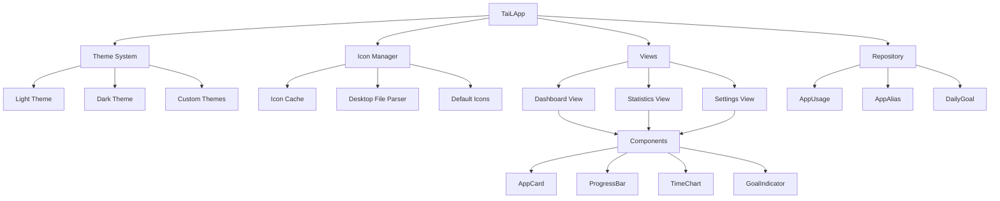

# TaiL UI 重设计计划

## 设计目标

参考 Windows 下 Tai 软件的设计理念，创建一个现代化、美观、易用的时间追踪界面。

## 核心改进点

### 1. 视觉设计改进

#### 字体和排版
- **增大字体尺寸**
  - 标题：24-28px（当前约 16px）
  - 应用名称：16-18px（当前约 12px）
  - 时长显示：14-16px（当前约 12px）
  - 次要文本：12-14px
- **字体层级**
  - 使用粗体突出重要信息
  - 使用不同字重区分信息层级
  - 增加行间距提高可读性

#### 配色方案
- **现代化配色**（参考 Tai）
  - 主色调：蓝色系（#4A90E2）
  - 强调色：绿色（成功）、橙色（警告）、红色（超限）
  - 背景：深色模式 #1E1E1E，浅色模式 #FFFFFF
  - 卡片背景：深色 #2D2D2D，浅色 #F5F5F5
- **渐变和阴影**
  - 使用微妙的渐变增加层次感
  - 添加卡片阴影提升立体感

#### 间距和布局
- 增加组件间距（从 5-10px 增加到 12-20px）
- 使用卡片式布局分组信息
- 添加圆角（8-12px）使界面更柔和

### 2. 应用图标支持

#### 图标获取策略
```rust
// 1. 从 .desktop 文件获取图标
// 2. 从应用程序目录查找图标
// 3. 使用默认图标作为后备
```

#### 实现方案
- 创建 `IconCache` 模块缓存图标
- 支持 SVG、PNG 格式
- 使用 egui 的 `Image` 组件显示
- 图标尺寸：32x32px（列表）、48x48px（详情）

#### 图标来源
1. **系统图标主题**
   - `/usr/share/icons/hicolor/`
   - `~/.local/share/icons/`
2. **Desktop 文件**
   - `/usr/share/applications/*.desktop`
   - `~/.local/share/applications/*.desktop`
3. **默认图标**
   - 使用 Unicode emoji 作为后备
   - 或使用简单的几何图形

### 3. 应用重命名功能

#### 数据模型扩展
```rust
// 在 tail-core/src/models.rs 添加
pub struct AppAlias {
    pub id: Option<i64>,
    pub original_name: String,
    pub display_name: String,
    pub icon_path: Option<String>,
    pub created_at: DateTime<Utc>,
}
```

#### 数据库表
```sql
CREATE TABLE IF NOT EXISTS app_aliases (
    id INTEGER PRIMARY KEY AUTOINCREMENT,
    original_name TEXT NOT NULL UNIQUE,
    display_name TEXT NOT NULL,
    icon_path TEXT,
    created_at TEXT NOT NULL
);
```

#### UI 交互
- 双击应用名称进入编辑模式
- 右键菜单提供"重命名"选项
- 显示原始名称的提示信息

### 4. 新的 UI 布局设计

#### 仪表板（Dashboard）

```
┌─────────────────────────────────────────────────────────┐
│  TaiL                    今天  本周  本月      [设置] [退出] │
├─────────────────────────────────────────────────────────┤
│                                                         │
│  📊 今日统计                                              │
│  ┌─────────────────────────────────────────────────┐   │
│  │  总使用时间                                        │   │
│  │  8小时 32分钟                                      │   │
│  │  ━━━━━━━━━━━━━━━━━━━━━━━━━━━━━━━━━━━━━━━━━━━━━━  │   │
│  │  目标: 10小时 | 剩余: 1小时 28分钟                  │   │
│  └─────────────────────────────────────────────────┘   │
│                                                         │
│  🏆 应用使用排行                                          │
│  ┌─────────────────────────────────────────────────┐   │
│  │  [图标] Visual Studio Code        5h 23m  ████████│   │
│  │        /home/user/project                       │   │
│  │                                                 │   │
│  │  [图标] Firefox                   2h 15m  ████   │   │
│  │        github.com                               │   │
│  │                                                 │   │
│  │  [图标] Terminal                  54m     ██     │   │
│  │        bash                                     │   │
│  └─────────────────────────────────────────────────┘   │
│                                                         │
└─────────────────────────────────────────────────────────┘
```

#### 统计页面（Statistics）

```
┌─────────────────────────────────────────────────────────┐
│  📈 详细统计                                              │
│  ┌─────────────────────────────────────────────────┐   │
│  │  [今天] [昨天] [本周] [本月] [自定义]              │   │
│  └─────────────────────────────────────────────────┘   │
│                                                         │
│  时间分布图                                              │
│  ┌─────────────────────────────────────────────────┐   │
│  │  ▁▂▃▅▇█▇▅▃▂▁                                      │   │
│  │  0  3  6  9  12 15 18 21 24                      │   │
│  └─────────────────────────────────────────────────┘   │
│                                                         │
│  应用详情                                                │
│  ┌─────────────────────────────────────────────────┐   │
│  │  排名  应用          时长      占比    趋势        │   │
│  │  1    [图标] Code   5h 23m    62%    ↑ 15%      │   │
│  │  2    [图标] Firefox 2h 15m   26%    ↓ 5%       │   │
│  │  3    [图标] Terminal 54m     10%    → 0%       │   │
│  └─────────────────────────────────────────────────┘   │
└─────────────────────────────────────────────────────────┘
```

### 5. 组件设计

#### AppCard 组件
```rust
struct AppCard {
    icon: Option<egui::TextureHandle>,
    app_name: String,
    display_name: String,
    duration: i64,
    percentage: f32,
    window_title: Option<String>,
}
```

#### 特性
- 卡片式设计，带圆角和阴影
- 悬停效果（高亮、显示详情）
- 点击展开显示窗口标题历史
- 右键菜单（重命名、设置目标、查看详情）

#### ProgressBar 增强
- 渐变色进度条
- 根据使用时长显示不同颜色
  - 绿色：正常范围
  - 橙色：接近目标
  - 红色：超过目标
- 动画效果

### 6. 主题系统增强

#### 自定义主题
```rust
pub struct TaiLTheme {
    // 颜色
    pub primary_color: Color32,
    pub accent_color: Color32,
    pub background_color: Color32,
    pub card_background: Color32,
    pub text_color: Color32,
    pub secondary_text_color: Color32,
    
    // 字体大小
    pub heading_size: f32,
    pub body_size: f32,
    pub small_size: f32,
    
    // 间距
    pub spacing: f32,
    pub card_padding: f32,
    pub card_rounding: f32,
}
```

#### 预设主题
- **Light Mode**：明亮、清爽
- **Dark Mode**：深色、护眼
- **Catppuccin**：流行的配色方案
- **Nord**：北欧风格配色

### 7. 动画和交互

#### 微动画
- 页面切换淡入淡出
- 进度条平滑增长
- 卡片悬停放大效果
- 数字变化动画

#### 交互反馈
- 按钮点击涟漪效果
- 拖拽排序应用列表
- 滚动时的视差效果

## 技术实现

### 依赖添加

```toml
[dependencies]
# 图标支持
freedesktop-icons = "0.2"
image = "0.24"

# 动画
eframe = { version = "0.28", features = ["default_fonts", "glow", "persistence"] }

# 配置文件
serde = { version = "1.0", features = ["derive"] }
toml = "0.8"
```

### 模块结构

```
tail-gui/
├── src/
│   ├── app.rs           # 主应用
│   ├── theme.rs         # 主题系统
│   ├── components/      # UI 组件
│   │   ├── mod.rs
│   │   ├── app_card.rs  # 应用卡片
│   │   ├── progress.rs  # 进度条
│   │   └── chart.rs     # 图表
│   ├── icons/           # 图标管理
│   │   ├── mod.rs
│   │   ├── cache.rs     # 图标缓存
│   │   └── loader.rs    # 图标加载
│   └── views/           # 视图
│       ├── mod.rs
│       ├── dashboard.rs
│       ├── statistics.rs
│       └── settings.rs
```

## 实现优先级

### Phase 1: 基础改进（高优先级）
1. ✅ 增大字体尺寸
2. ✅ 改进间距和布局
3. ✅ 实现卡片式设计
4. ✅ 增强配色方案

### Phase 2: 功能增强（中优先级）
1. 🔄 实现应用图标支持
2. 🔄 添加应用重命名功能
3. 🔄 创建自定义主题系统
4. 🔄 添加进度条渐变效果

### Phase 3: 高级特性（低优先级）
1. ⏳ 实现动画效果
2. ⏳ 添加图表可视化
3. ⏳ 实现拖拽排序
4. ⏳ 添加导出功能

## 设计参考

### Tai 软件特点
- 简洁的卡片式布局
- 清晰的信息层级
- 直观的时间可视化
- 应用图标展示
- 目标进度追踪

### 设计原则
1. **简洁优先**：避免信息过载
2. **一致性**：统一的视觉语言
3. **可访问性**：良好的对比度和字体大小
4. **响应式**：适应不同窗口大小
5. **性能**：流畅的 60fps 渲染

## Mermaid 架构图



## 下一步行动

1. 创建 UI 组件模块结构
2. 实现图标加载和缓存系统
3. 扩展数据模型支持应用别名
4. 重构现有视图使用新组件
5. 实现主题切换功能
6. 添加配置持久化

## 预期效果

完成后的 TaiL 将拥有：
- 🎨 现代化、美观的界面
- 📱 清晰的信息展示
- 🖼️ 应用图标支持
- ✏️ 灵活的应用重命名
- 🎯 直观的目标追踪
- 🌈 多主题支持

这将使 TaiL 成为 Linux/Wayland 平台上最优秀的时间追踪工具之一！